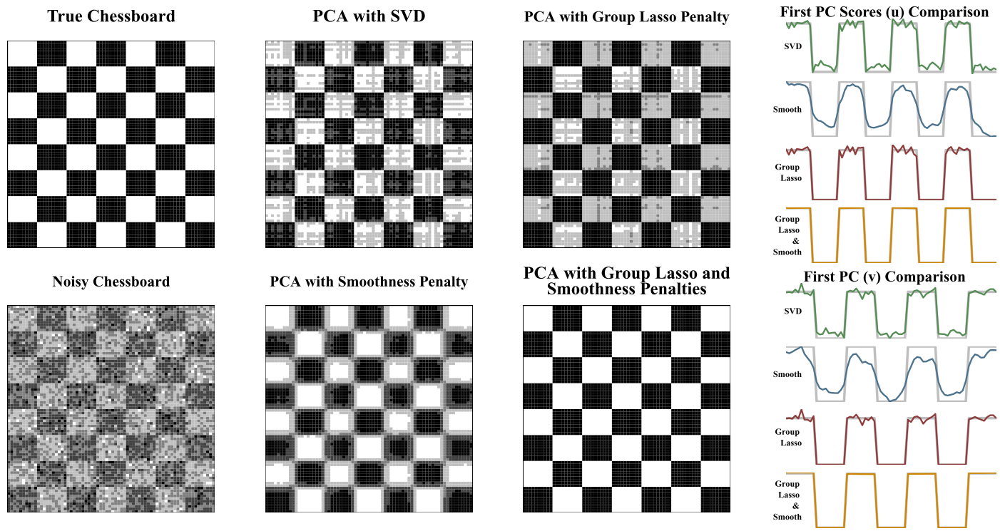
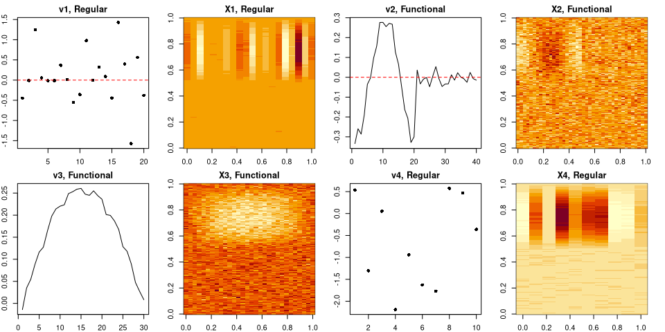
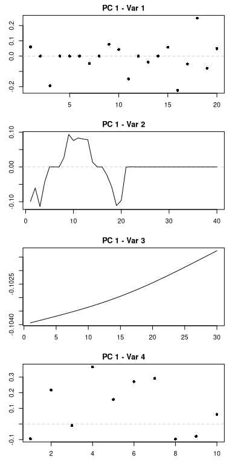
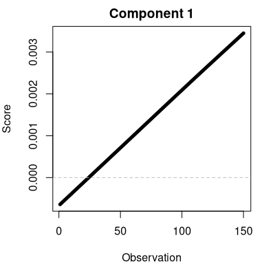
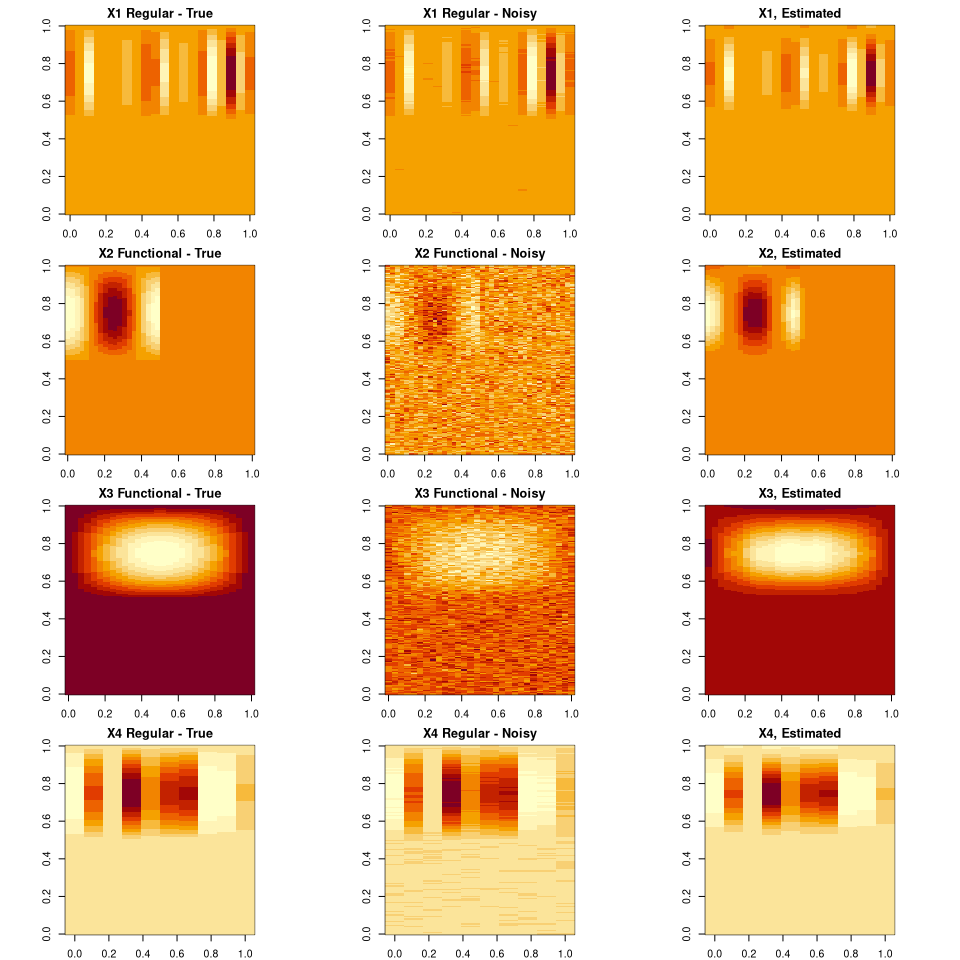
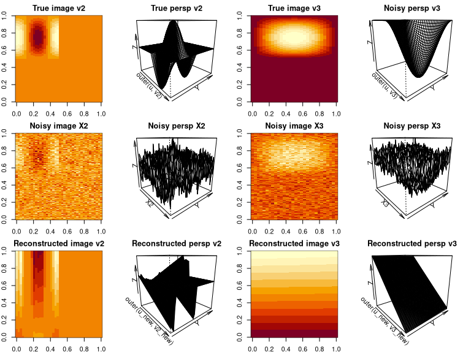
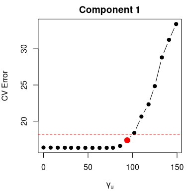
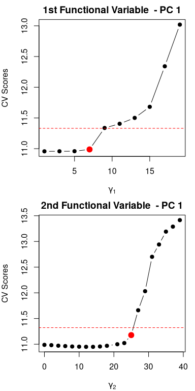
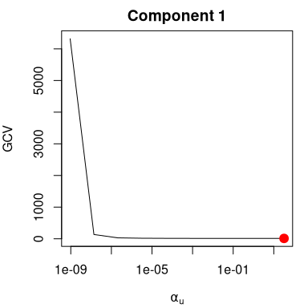
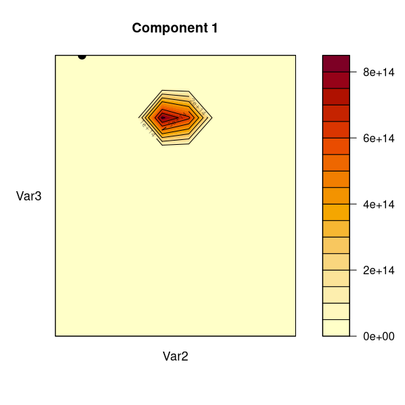

# ReMPCA Package

<!-- badges: start -->

<!--[](https://github.com/mobinapourmoshir/ReMPCA/actions/workflows/R-CMD-check.yaml)-->

<!-- badges: end -->

<!-- badges: start -->

<!-- badges: end -->

ReMPCA is an R package designed to extend Principal Component Analysis
(PCA) to complex, high-dimensional datasets—including curves, images,
functional, and regular data. By integrating multiple data types within
a single framework, ReMPCA captures intricate relationships across
variables and domains, making it an ideal tool for structured data
analysis in fields like imaging, signal processing, and functional data
analysis.

Unlike traditional PCA methods, ReMPCA offers flexible, fine-grained
control through one- and two-way regularization. Users can independently
apply smoothing and sparsity to different data components, with tailored
regularization parameters across functional and regular sections. Built
on an enhanced power algorithm, the package dynamically refines
components and quantifies explained variance, delivering a powerful and
unified solution for extracting meaningful structure from hybrid
datasets.

Implementing varied penalties on both $u$ and $v$ improves accuracy. As
shown in Figure below, for a noisy chessboard, applying the power
algorithm with customized penalties, such as smoothness and group lasso,
enforces a step-function structure in $u$ and $v$, refining the vectors
and yielding a reconstruction close to the true chessboard. More
importantly, regularizing both directions simultaneously is more
effective than separate one-way penalties, better preserving the data’s
true structure.


## Installation 

To install the ReMPCA Package from GitHub, use the following code:  

``` r
# install.packages("remotes")
remotes::install_github("mobinapourmoshir/ReMPCA")
```

## Data and analysis code

The data and analysis code used for the Bike Sharing application are
included in this repository to support reproducibility. The processed
data files are available in the [`data`](data) folder, including
[`bike_day.rda`](data/bike_day.rda) and
[`bike_hour.rda`](data/bike_hour.rda).

The complete R code used for the Bike Sharing analysis is available in
the [`inst`](inst) folder as
[`ReMPCA_bike_example.R`](inst/ReMPCA_bike_example.R). These materials
can be used to reproduce the analysis and figures presented in the
paper.

## Example

The following example demonstrates how to generate q hybrid data (both
regular and functional) and construct the input objects required for
running `ReMPCA`:

``` r
library(ReMPCA)
set.seed(123)

# Create a common left singular vector u (length 150), with sparsity in the first half
x <- seq(0, 2 * pi, length.out = 150)
u <- sin(x)
u[1:75] <- 0

### Construct 4 variables with different characteristics

# Variable 1: Sparse right singular vector
m1 <- 20
v1 <- rnorm(m1, sd = 0.8)
v1[sample(1:m1, 5)] <- v1[sample(1:m1, 5)] * 1e-2 + rnorm(5, sd = 0.01)
X1 <- outer(u, v1) + rnorm(150 * m1, sd = 0.03)

# Variable 2: Piecewise smooth right singular vector (functional)
x2 <- seq(0, 2 * pi, length.out = 40)
v2 <- cos(2 * x2)
v2[21:40] <- 0  # Create piecewise structure
X2 <- outer(u, v2) + rnorm(150 * 40, sd = 0.5)

# Variable 3: Smooth right singular vector (functional)
m3 <- 30
x3 <- seq(0, pi, length.out = m3)
v3 <- sin(x3)
X3 <- outer(u, v3) + rnorm(150 * m3, sd = 0.2)

# Variable 4: Random structure
m4 <- 10
v4 <- rnorm(m4)
X4 <- outer(u, v4) + rnorm(150 * m4, sd = 0.05)

# Combine all variables into a single matrix (optional, not used directly)
X <- cbind(X1, X2, X3, X4)

### Create hybrid data objects

# Regular data (RD) object
rd_object1 <- rdClass(
  data = as.matrix(X1),
  Sparsity_parameter = round(seq(1, 19, length.out = 10))
)

# Functional data (FD) objects
fd_object2 <- fdClass(
  data = as.matrix(X2),
  argval = NULL,
  Smoothing_parameter = NULL,
  Sparsity_parameter = round(seq(0, 39, length.out = 20))
)

fd_object3 <- fdClass(
  data = as.matrix(X3),
  argval = NULL,
  Smoothing_parameter = NULL,
  Sparsity_parameter = 0
)

# Another regular data object
rd_object4 <- rdClass(
  data = as.matrix(X4),
  Sparsity_parameter = 0
)

# Combine all objects into a hybrid data structure
hd_list <- list(rd_object1, fd_object2, fd_object3, rd_object4)
object_list <- hdClass(
  hdlist = hd_list,
  argval = NULL,
  Smoothing_parameter = NULL,
  Sparsity_parameter = round(seq(0, 149, length.out = 20))
)

# Plot the data
par(mfrow = c(2, 4), pin = c(1, 1), mar = c(2, 2, 2, 2), pty = "s")

# Variable 1: Regular
matplot(v1, type = 'p', pch = 16, main = 'v1, Regular') 
abline(h = 0, col = 'red', lty = 2)
image(t(X1), main = 'X1, Regular')

# Variable 2: Functional
matplot(svd(X2)$v[,1], type = 'l', main = 'v2, Functional') 
abline(h = 0, col = 'red', lty = 2)
image(t(X2), main = 'X2, Functional')

# Variable 3: Functional
matplot(svd(X3)$v[,1], type = 'l', main = 'v3, Functional')
image(t(X3), main = 'X3, Functional')

# Variable 4: Regular
matplot(v4, type = 'p', pch = 16, main = 'v4, Regular')
image(t(X4), main = 'X4, Regular')
```

<!-- -->

## Regularized Multivariate Hybrid PCA function

Now that we have constructed our hybrid data object, we can apply the
`ReMPCA` function to extract the principal components while
incorporating smoothing and sparsity constraints.

``` r
ReMPCATest <- ReMPCA(hd = object_list,
                     centerhds = FALSE,
                     num_pcs = 1,
                     nfolds_u = 5,
                     nfolds_v = NULL,
                     thresh = 1e-10,
                     maxit = 100,
                     tuning_iter = 1,
                     parallel = FALSE,
                     weights = 0,
                     smoothness_type = "Second_order",
                     sparse_tuning_type = "soft",
                     tuning_order = "Sparsity",
                     cv.pick = "1se",
                     sparse_tuning_u = NULL,
                     sparse_tuning_v = NULL,
                     smooth_tuning_u = NULL,
                     smooth_tuning_v = NULL)
```

### `plot` method

A variety of informative visualizations are available to help users
interpret and evaluate results from the regularized multivariate hybrid
PCA model. These include: PC function plots, which visualize the
estimated principal component functions for each hybrid variable, with
appropriate rendering for functional, regular, and image data types; PC
score plots, which display the scores of the observations along selected
components to help assess clustering or variation; cross-validation (CV)
plots, which show the CV error curves across different sparsity levels
to aid in selecting optimal sparsity parameters; and generalized
cross-validation (GCV) plots, which depict the GCV criterion over
smoothing parameter grids to guide smoothness selection. Each plot
adapts automatically to the structure of the hybrid data and provides
intuitive graphical insight into the dimensionality reduction process.

#### PC and PC scores plots

Once the model has been fitted, we can examine the output to see the
principal components and their corresponding scores:

``` r
# Plot v 
plot_pc_functions(ReMPCATest)
```

<!-- -->

``` r
# Plot u
plot_pc_scores(ReMPCATest)
```

<!-- -->

#### Reconstructed data

The reconstructed hybrid data, obtained after applying sparsity and
smoothness through the ReMPCA framework, is shown below.

``` r
u_new <- ReMPCATest$PCScores[,1]
v1_new <- as.vector(ReMPCATest$PCFunctions[[1]][[1]])
v2_new <- as.vector(ReMPCATest$PCFunctions[[1]][[2]])
v3_new <- as.vector(ReMPCATest$PCFunctions[[1]][[3]])
v4_new <- as.vector(ReMPCATest$PCFunctions[[1]][[4]])

par(mfrow = c(4, 3), pin = c(1, 1), mar = c(2, 2, 2, 2), pty = "s")
# Var1
image(t(outer(u, v1)), main = 'X1 Regular - True')
image(t(X1), main = 'X1 Regular - Noisy')
image(t(outer(u_new, v1_new)), main = 'X1, Estimated')

# Var2
image(t(outer(u, v2)), main = 'X2 Functional - True')
image(t(X2), main = 'X2 Functional - Noisy')
image(t(outer(u_new, v2_new)), main = 'X2, Estimated')

# Var3
image(t(outer(u, v3)), main = 'X3 Functional - True')
image(t(X3), main = 'X3 Functional - Noisy')
image(t(outer(u_new, v3_new)), main = 'X3, Estimated')


# Var4
image(t(outer(u, v4)), main = 'X4 Regular - True')
image(t(X4), main = 'X4 Regular - Noisy')
image(t(outer(u_new, v4_new)), main = 'X4, Estimated')
```

<!-- --> In addition, the
reconstructed two-way functional variables are displayed below.

``` r
# Plot 3D image
par(mfrow = c(3, 4), pin = c(1, 1), mar = c(2, 2, 2, 2))
# True
image(t(outer(u, v2)), main = "True image v2")
persp(outer(u, v2), theta = 50, main = "True persp v2")
image(t(outer(u, v3)), main = "True image v3")
persp(outer(u, v3), theta = 50, main = "Noisy persp v3")

# Noisy
image(t(X2), main = "Noisy image X2")
persp(X2, theta = 50, main = "Noisy persp X2")
image(t(X3), main = "Noisy image X3")
persp(X3, theta = 50, main = "Noisy persp X3")

# Reconstructed
image(t(outer(u_new, v2_new)), main = "Reconstructed image v2")
persp(outer(u_new, v2_new), theta = 50, main = "Reconstructed persp v2")
image(t(outer(u_new, v3_new)), main = "Reconstructed image v3")
persp(outer(u_new, v3_new), theta = 50, main = "Reconstructed persp v3")
```

<!-- -->

#### CV and GCV Plots

Finally, cross-validation (CV) plots for tuning sparsity and generalized
cross-validation (GCV) plots for selecting smoothness parameters can be
produced as follows:

``` r
# CV Plot for tuning sparsity for u 
plot_cv_u(ReMPCATest)
```

    ## Warning in arrows(gamma_vals, cv_means - cv_ses, gamma_vals, cv_means + :
    ## zero-length arrow is of indeterminate angle and so skipped
    ## Warning in arrows(gamma_vals, cv_means - cv_ses, gamma_vals, cv_means + :
    ## zero-length arrow is of indeterminate angle and so skipped
    ## Warning in arrows(gamma_vals, cv_means - cv_ses, gamma_vals, cv_means + :
    ## zero-length arrow is of indeterminate angle and so skipped
    ## Warning in arrows(gamma_vals, cv_means - cv_ses, gamma_vals, cv_means + :
    ## zero-length arrow is of indeterminate angle and so skipped
    ## Warning in arrows(gamma_vals, cv_means - cv_ses, gamma_vals, cv_means + :
    ## zero-length arrow is of indeterminate angle and so skipped

<!-- -->

``` r
# CV Plot for tuning sparsity for v
plot_cv_v(ReMPCATest)
```

<!-- -->

``` r
# GCV Plot for tuning smoothness for u 
plot_gcv_u(ReMPCATest)
```

<!-- -->

``` r
# GCV Plot for tuning smoothness for v
plot_gcv_v(ReMPCATest)
```

<!-- -->
