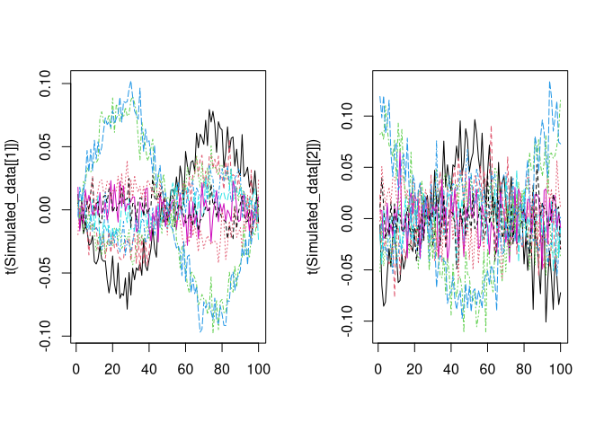
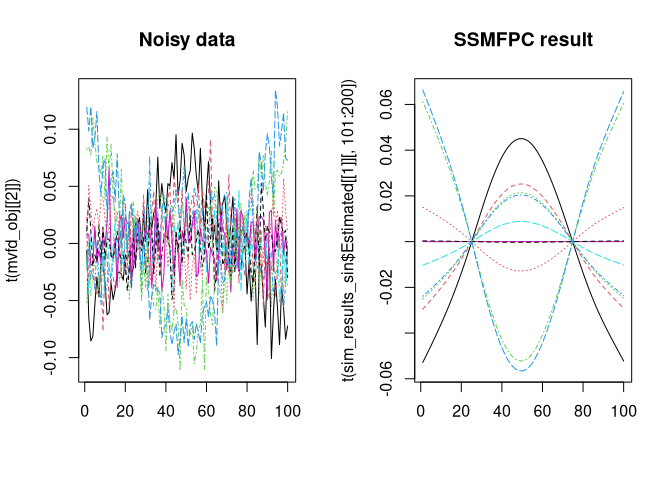

# SSFPC

<!-- badges: start -->
<!-- badges: end -->

The goal of SSFPC is to do Smooth and Sparse Multivariate Functional
Principal Component Analysis.

## Installation

You can install SSFPC Package from github with the following code:

``` r
# install.packages("remotes")
remotes::install_github("mobinapourmoshir/SSFPC")
```

    ## Downloading GitHub repo mobinapourmoshir/SSFPC@HEAD

    ## ── R CMD build ─────────────────────────────────────────────────────────────────
    ##      checking for file ‘/tmp/RtmpxuoZro/remotes1bad1867b62bf5/mobinapourmoshir-SSFPC-4328dc6/DESCRIPTION’ ...  ✔  checking for file ‘/tmp/RtmpxuoZro/remotes1bad1867b62bf5/mobinapourmoshir-SSFPC-4328dc6/DESCRIPTION’
    ##   ─  preparing ‘SSFPC’:
    ##    checking DESCRIPTION meta-information ...  ✔  checking DESCRIPTION meta-information
    ##   ─  checking for LF line-endings in source and make files and shell scripts
    ##   ─  checking for empty or unneeded directories
    ##   ─  building ‘SSFPC_0.0.0.9000.tar.gz’
    ##      
    ## 

    ## Installing package into '/users/personnel/pmobina/R/x86_64-redhat-linux-gnu-library/4.4'
    ## (as 'lib' is unspecified)

## Example

Here is a basic example with simulated data:

``` r
library(SSFPC)

data_sin <- function(){
  set.seed(123)
  t1 <- "p"; t2 <- "l"; n <- 10; m <- 100; sig <- 0.01; alpha1 <- 1; alpha2 <- 0
  t <- seq(0,2*pi,length=m); 
  v1 <- sin(t); v1 <- v1/sqrt(sum(v1^2))
  v2 <- cos(t); v2 <- v2/sqrt(sum(v2^2))
  u <- sort(rnorm(n)); u <- u/sqrt(sum(u^2)); 
  ind <- which.max(abs(u)); u <- sign(u[ind])*u
  X <- u%*%t(v1)+rnorm(length(u)*length(v1),sd=sig)
  Y <- u%*%t(v2)+rnorm(length(u)*length(v1),sd=0.02)
  matplot(t(X), type = 'l')
  matplot(t(Y), type = 'l')
  
  
  argval_simdata <- list(t,t)
  Simulated_data = list(X, Y)
  return(Simulated_data)
}

Simulated_data <- data_sin()
```

<!-- --><!-- -->

Let’s see the results!

``` r
sim_results_sin <- SSMFPCfunc(mvfd_obj = Simulated_data, argval = NULL, centerfns = TRUE,
                              num_pcs = 1, smooth_tuning =NULL, sparse_tuning_type = "soft", sparse_tuning = NULL)
```

    ## Preprocessing ...
    ##   |                                                          |                                                  |   0%  |                                                          |                                                  |   1%  |                                                          |=                                                 |   1%  |                                                          |=                                                 |   2%  |                                                          |=                                                 |   3%  |                                                          |==                                                |   3%  |                                                          |==                                                |   4%  |                                                          |==                                                |   5%  |                                                          |===                                               |   5%  |                                                          |===                                               |   6%  |                                                          |===                                               |   7%  |                                                          |====                                              |   7%  |                                                          |====                                              |   8%  |                                                          |====                                              |   9%  |                                                          |=====                                             |   9%  |                                                          |=====                                             |  10%  |                                                          |=====                                             |  11%  |                                                          |======                                            |  11%  |                                                          |======                                            |  12%  |                                                          |======                                            |  13%  |                                                          |=======                                           |  13%  |                                                          |=======                                           |  14%  |                                                          |=======                                           |  15%  |                                                          |========                                          |  15%  |                                                          |========                                          |  16%  |                                                          |========                                          |  17%  |                                                          |=========                                         |  17%  |                                                          |=========                                         |  18%  |                                                          |=========                                         |  19%  |                                                          |==========                                        |  19%  |                                                          |==========                                        |  20%  |                                                          |==========                                        |  21%  |                                                          |===========                                       |  21%  |                                                          |===========                                       |  22%  |                                                          |===========                                       |  23%  |                                                          |============                                      |  23%  |                                                          |============                                      |  24%  |                                                          |============                                      |  25%  |                                                          |=============                                     |  25%  |                                                          |=============                                     |  26%  |                                                          |=============                                     |  27%  |                                                          |==============                                    |  27%  |                                                          |==============                                    |  28%  |                                                          |==============                                    |  29%  |                                                          |===============                                   |  29%  |                                                          |===============                                   |  30%  |                                                          |===============                                   |  31%  |                                                          |================                                  |  31%  |                                                          |================                                  |  32%  |                                                          |================                                  |  33%  |                                                          |=================                                 |  33%  |                                                          |=================                                 |  34%  |                                                          |=================                                 |  35%  |                                                          |==================                                |  35%  |                                                          |==================                                |  36%  |                                                          |==================                                |  37%  |                                                          |===================                               |  37%  |                                                          |===================                               |  38%  |                                                          |===================                               |  39%  |                                                          |====================                              |  39%  |                                                          |====================                              |  40%  |                                                          |====================                              |  41%  |                                                          |=====================                             |  41%  |                                                          |=====================                             |  42%  |                                                          |=====================                             |  43%  |                                                          |======================                            |  43%  |                                                          |======================                            |  44%  |                                                          |======================                            |  45%  |                                                          |=======================                           |  45%  |                                                          |=======================                           |  46%  |                                                          |=======================                           |  47%  |                                                          |========================                          |  47%  |                                                          |========================                          |  48%  |                                                          |========================                          |  49%  |                                                          |=========================                         |  49%  |                                                          |=========================                         |  50%  |                                                          |=========================                         |  51%  |                                                          |==========================                        |  51%  |                                                          |==========================                        |  52%  |                                                          |==========================                        |  53%  |                                                          |===========================                       |  53%  |                                                          |===========================                       |  54%  |                                                          |===========================                       |  55%  |                                                          |============================                      |  55%  |                                                          |============================                      |  56%  |                                                          |============================                      |  57%  |                                                          |=============================                     |  57%  |                                                          |=============================                     |  58%  |                                                          |=============================                     |  59%  |                                                          |==============================                    |  59%  |                                                          |==============================                    |  60%  |                                                          |==============================                    |  61%  |                                                          |===============================                   |  61%  |                                                          |===============================                   |  62%  |                                                          |===============================                   |  63%  |                                                          |================================                  |  63%  |                                                          |================================                  |  64%  |                                                          |================================                  |  65%  |                                                          |=================================                 |  65%  |                                                          |=================================                 |  66%  |                                                          |=================================                 |  67%  |                                                          |==================================                |  67%  |                                                          |==================================                |  68%  |                                                          |==================================                |  69%  |                                                          |===================================               |  69%  |                                                          |===================================               |  70%  |                                                          |===================================               |  71%  |                                                          |====================================              |  71%  |                                                          |====================================              |  72%  |                                                          |====================================              |  73%  |                                                          |=====================================             |  73%  |                                                          |=====================================             |  74%  |                                                          |=====================================             |  75%  |                                                          |======================================            |  75%  |                                                          |======================================            |  76%  |                                                          |======================================            |  77%  |                                                          |=======================================           |  77%  |                                                          |=======================================           |  78%  |                                                          |=======================================           |  79%  |                                                          |========================================          |  79%  |                                                          |========================================          |  80%  |                                                          |========================================          |  81%  |                                                          |=========================================         |  81%  |                                                          |=========================================         |  82%  |                                                          |=========================================         |  83%  |                                                          |==========================================        |  83%  |                                                          |==========================================        |  84%  |                                                          |==========================================        |  85%  |                                                          |===========================================       |  85%  |                                                          |===========================================       |  86%  |                                                          |===========================================       |  87%  |                                                          |============================================      |  87%  |                                                          |============================================      |  88%  |                                                          |============================================      |  89%  |                                                          |=============================================     |  89%  |                                                          |=============================================     |  90%  |                                                          |=============================================     |  91%  |                                                          |==============================================    |  91%  |                                                          |==============================================    |  92%  |                                                          |==============================================    |  93%  |                                                          |===============================================   |  93%  |                                                          |===============================================   |  94%  |                                                          |===============================================   |  95%  |                                                          |================================================  |  95%  |                                                          |================================================  |  96%  |                                                          |================================================  |  97%  |                                                          |================================================= |  97%  |                                                          |================================================= |  98%  |                                                          |================================================= |  99%  |                                                          |==================================================|  99%  |                                                          |==================================================| 100%
    ## Computing the 1st PC ...
    ##   |                                                          |                                                  |   0%  |                                                          |                                                  |   1%  |                                                          |=                                                 |   1%  |                                                          |=                                                 |   2%  |                                                          |=                                                 |   3%  |                                                          |==                                                |   3%  |                                                          |==                                                |   4%  |                                                          |                                                  |   0%  |                                                          |                                                  |   1%  |                                                          |=                                                 |   1%  |                                                          |=                                                 |   2%  |                                                          |=                                                 |   3%  |                                                          |==                                                |   3%  |                                                          |==                                                |   4%  |                                                          |==                                                |   5%  |                                                          |===                                               |   5%  |                                                          |===                                               |   6%  |                                                          |===                                               |   7%  |                                                          |====                                              |   7%  |                                                          |====                                              |   8%  |                                                          |====                                              |   9%  |                                                          |=====                                             |   9%  |                                                          |=====                                             |  10%  |                                                          |=====                                             |  11%  |                                                          |======                                            |  11%  |                                                          |======                                            |  12%  |                                                          |======                                            |  13%  |                                                          |=======                                           |  13%  |                                                          |=======                                           |  14%  |                                                          |=======                                           |  15%  |                                                          |========                                          |  15%  |                                                          |========                                          |  16%  |                                                          |========                                          |  17%  |                                                          |=========                                         |  17%  |                                                          |=========                                         |  18%  |                                                          |=========                                         |  19%  |                                                          |==========                                        |  19%  |                                                          |==========                                        |  20%  |                                                          |==========                                        |  21%  |                                                          |===========                                       |  21%  |                                                          |===========                                       |  22%  |                                                          |===========                                       |  23%  |                                                          |============                                      |  23%  |                                                          |============                                      |  24%  |                                                          |============                                      |  25%  |                                                          |=============                                     |  25%  |                                                          |=============                                     |  26%  |                                                          |=============                                     |  27%  |                                                          |==============                                    |  27%  |                                                          |==============                                    |  28%  |                                                          |==============                                    |  29%  |                                                          |===============                                   |  29%  |                                                          |===============                                   |  30%  |                                                          |===============                                   |  31%  |                                                          |================                                  |  31%  |                                                          |================                                  |  32%  |                                                          |================                                  |  33%  |                                                          |=================                                 |  33%  |                                                          |=================                                 |  34%  |                                                          |=================                                 |  35%  |                                                          |==================                                |  35%  |                                                          |==================                                |  36%  |                                                          |==================                                |  37%  |                                                          |===================                               |  37%  |                                                          |===================                               |  38%  |                                                          |===================                               |  39%  |                                                          |====================                              |  39%  |                                                          |====================                              |  40%  |                                                          |====================                              |  41%  |                                                          |=====================                             |  41%  |                                                          |=====================                             |  42%  |                                                          |=====================                             |  43%  |                                                          |======================                            |  43%  |                                                          |======================                            |  44%  |                                                          |======================                            |  45%  |                                                          |=======================                           |  45%  |                                                          |=======================                           |  46%  |                                                          |=======================                           |  47%  |                                                          |========================                          |  47%  |                                                          |========================                          |  48%  |                                                          |========================                          |  49%  |                                                          |=========================                         |  49%  |                                                          |=========================                         |  50%  |                                                          |=========================                         |  51%  |                                                          |==========================                        |  51%  |                                                          |==========================                        |  52%  |                                                          |==========================                        |  53%  |                                                          |===========================                       |  53%  |                                                          |===========================                       |  54%  |                                                          |===========================                       |  55%  |                                                          |============================                      |  55%  |                                                          |============================                      |  56%  |                                                          |============================                      |  57%  |                                                          |=============================                     |  57%  |                                                          |=============================                     |  58%  |                                                          |=============================                     |  59%  |                                                          |==============================                    |  59%  |                                                          |==============================                    |  60%  |                                                          |==============================                    |  61%  |                                                          |===============================                   |  61%  |                                                          |===============================                   |  62%  |                                                          |===============================                   |  63%  |                                                          |================================                  |  63%  |                                                          |================================                  |  64%  |                                                          |================================                  |  65%  |                                                          |=================================                 |  65%  |                                                          |=================================                 |  66%  |                                                          |=================================                 |  67%  |                                                          |==================================                |  67%  |                                                          |==================================                |  68%  |                                                          |==================================                |  69%  |                                                          |===================================               |  69%  |                                                          |===================================               |  70%  |                                                          |===================================               |  71%  |                                                          |====================================              |  71%  |                                                          |====================================              |  72%  |                                                          |====================================              |  73%  |                                                          |=====================================             |  73%  |                                                          |=====================================             |  74%  |                                                          |=====================================             |  75%  |                                                          |======================================            |  75%  |                                                          |======================================            |  76%  |                                                          |======================================            |  77%  |                                                          |=======================================           |  77%  |                                                          |=======================================           |  78%  |                                                          |=======================================           |  79%  |                                                          |========================================          |  79%  |                                                          |========================================          |  80%  |                                                          |========================================          |  81%  |                                                          |=========================================         |  81%  |                                                          |=========================================         |  82%  |                                                          |=========================================         |  83%  |                                                          |==========================================        |  83%  |                                                          |==========================================        |  84%  |                                                          |==========================================        |  85%  |                                                          |===========================================       |  85%  |                                                          |===========================================       |  86%  |                                                          |===========================================       |  87%  |                                                          |============================================      |  87%  |                                                          |============================================      |  88%  |                                                          |============================================      |  89%  |                                                          |=============================================     |  89%  |                                                          |=============================================     |  90%  |                                                          |=============================================     |  91%  |                                                          |==============================================    |  91%  |                                                          |==============================================    |  92%  |                                                          |==============================================    |  93%  |                                                          |===============================================   |  93%  |                                                          |===============================================   |  94%  |                                                          |===============================================   |  95%  |                                                          |================================================  |  95%  |                                                          |================================================  |  96%  |                                                          |================================================  |  97%  |                                                          |================================================= |  97%  |                                                          |================================================= |  98%  |                                                          |================================================= |  99%  |                                                          |==================================================|  99%  |                                                          |==================================================| 100%

And the Plots:

``` r
t1 <- "p"; t2 <- "l"; n <- 10; m <- 100; sig <- 0.01; alpha1 <- 0; alpha2 <- 0
t <- seq(0,2*pi,length=m); 
v1 <- sin(t); v1 <- v1/sqrt(sum(v1^2))
v2 <- cos(t); v2 <- v2/sqrt(sum(v2^2))
u <- sort(rnorm(n)); u <- u/sqrt(sum(u^2))

PCss <- sim_results_sin[[1]]
mvfd_obj = Simulated_data
par(mfrow = c(1,3))
# Var 1
matplot(t(u%*%t(v1)),type="l", main = "TRUE X")
matplot(t(mvfd_obj[[1]]), type = 'l', main = "Noisy data")
matplot(t(sim_results_sin$Estimated[[1]][,1:100]), type = 'l', main = "SSMFPC result")
```

<!-- -->

``` r
# Var 2
matplot(t(u%*%t(v2)),type="l", main = "TRUE Y")
matplot(t(mvfd_obj[[2]]), type = 'l', main = "Noisy data")
matplot(t(sim_results_sin$Estimated[[1]][,101:200]), type = 'l', main = "SSMFPC result")
```

<!-- -->
